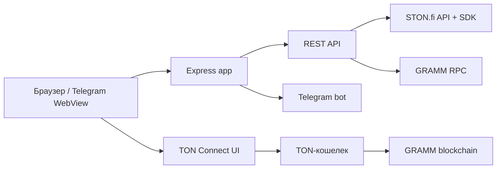

# Архитектура

## Серверный слой

`app.js` настраивает Helmet, CORS, compression, JSON parser и раздачу статики. HTML-маршруты `/` и `/buy` возвращают один `index.html`; `/buy` отличается только клиентским автозапуском сценария покупки.

API подключен под `/api`. Ошибки неизвестных маршрутов возвращаются в JSON, поэтому frontend не должен ожидать HTML-страницу ошибки.

## Клиентский слой

`main.js` — обычный browser script без bundler и модулей. Он выполняется с `defer`, получает элементы по `id`/CSS-селекторам и связывает:

1. визуальные эффекты и навигацию;
2. периодическое обновление рыночных данных;
3. загрузку TON Connect SDK;
4. расчет котировки;
5. подготовку и отправку транзакции в кошелек;
6. копирование адреса контракта и публикацию устава.

## Граница доверия

Frontend не строит blockchain payload самостоятельно. Он запрашивает `/api/swap/prepare`, получает объект `transaction` и передает его в `tonConnectUI.sendTransaction()`. Пользователь подтверждает транзакцию в кошельке.

:::note
Котировка не резервирует цену. Между расчетом и подтверждением транзакции состояние пула может измениться; защитой служит `minimumReceived`, рассчитанный с учетом slippage.
:::
