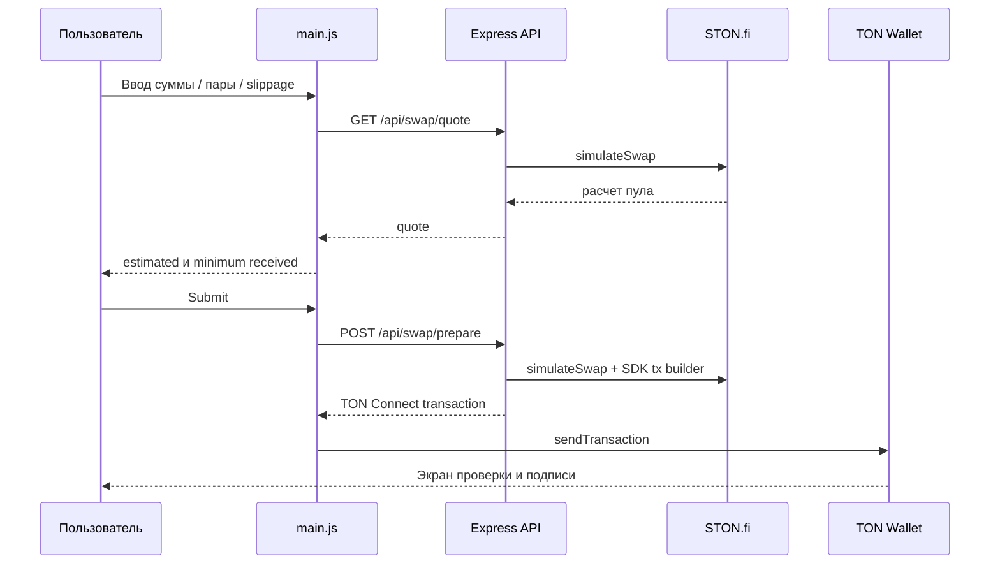

# Сценарий обмена

## Debounce котировки

Любое изменение суммы, токена или slippage запускает `queueSwapQuote()`. Таймер 250 мс снижает число запросов при вводе.

## Buy deep links

Сценарий автоматически выбирает GRAMM → CASA, прокручивает к swap и открывает TON Connect для:

- `/buy`;
- `?connect=1`;
- `?buy=casa`.

## Direct и multi-hop

Прямые пары строятся STON.fi SDK. Для Jetton → Jetton API может получить multi-hop котировку через GRAMM, но подготовка multi-message транзакции пока возвращает `MULTIHOP_TX_PENDING`. Production UI должен корректно показывать эту ошибку и не обещать выполнение.

## Безопасность

- сервер повторно получает котировку при `/swap/prepare`;
- приватные ключи не передаются приложению;
- подпись выполняется только в кошельке;
- `validUntil` ограничивает транзакцию пятью минутами;
- пользователь должен проверить токены, сумму, получателя и комиссии в wallet UI.
